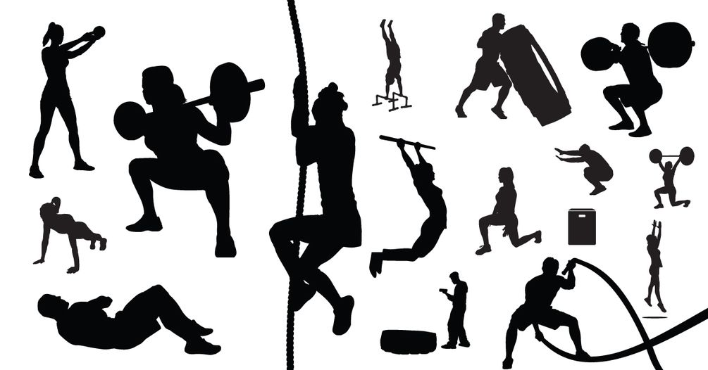

# Code Workouts
Repository for Code Workouts of the Day 💪🏼

## Introduction
The idea is to improve programming skills through practice and repetition, a movement commonly known as [_kata_ or _code kata_](http://codekata.com/).\
Karate is not that familiar to me, but CrossFit&copy; is. In this modality, there is a continuous hone of basic/simple skills and chaining of those, contributing to the mastery of more complex movements, then applied in a [WOD](https://www.crossfit.com/workout/) (Workout Of the Day). The concept is applied here &mdash; continuous learning through CWOD (Code Workout of the Day).

## Code Workouts Of the Day (CWODs)

1. [CQRS Booking](./CQRSBooking/)
1. [Karate Chops](./KarateChops/)
1. [String Calculator](./StringCalculator/)
1. [Vending Machine](./VendingMachine/)
1. [Bowling Game](./BowlingGame/)
1. [Stats Calculation](./StatsCalculation)
1. [Closest to Zero](./Closest2Zero)
1. [Roman Numerals](./RomanNumerals)
1. [Ransom Note](./RansomNote)
1. [Tennis Game](./TennisGame)
1. [Args Parser](./ArgsParser)
1. [Fizz Buzz](./FizzBuzz)
1. [Leap Years](./LeapYears/)